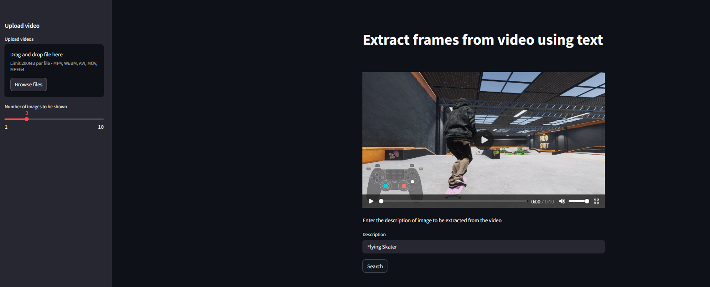
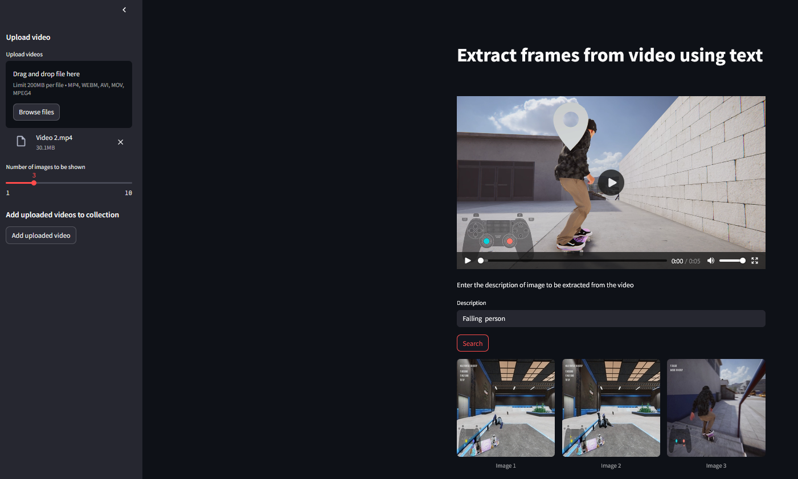
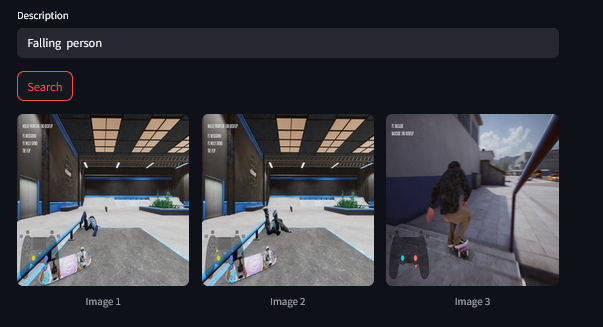

# FrameFinder 🔗 [Live Application](<https://huggingface.co/spaces/ashish-001/Frame_Finder>)

This project extracts frames from a video at specified intervals, processes them to generate embeddings using the CLIP model, and stores the embeddings in a database.

## Features
- Extracts frames from a video without overlap
- Converts frames to embeddings using OpenAI's CLIP model
- Stores embeddings in ChromaDB
- Uses Streamlit for UI with file upload and status indicators
- Supports text-based search to retrieve relevant frames
- Provides adjustable parameters like frame interval and number of results

## Installation
1. Clone the repository:
   ```sh
   git clone https://github.com/Ashish-C01/Frame_Finder.git
   cd Frame_Finder
   ```
2. Install dependencies:
   ```sh
   pip install -r requirements.txt
   ```
3. Set up environment variables in a `.env` file:
   ```
   hf_token=<your_huggingface_token>
   ```
## Initialization
Before running the app for the first time, initialize the embedding database:
1. Create a folder named `Videos` in the root directory.
2. Add a video file named `Video.mp4` inside the `Videos` folder.
3. Create a folder named `Data` in the root directory for storing ChromaDB data.
4. Run the embedding script:
   ```sh
   python embed_from_video.py
   ```
This will extract frames from the video and store their embeddings in ChromaDB.

## Usage
1. Run the Streamlit app:
   ```sh
   streamlit run app.py
   ```
2. Upload a video via the sidebar.
3. Extract frames at a chosen interval and generate embeddings.
4. Use the text search feature to retrieve relevant frames based on descriptions.

## Configuration
- `frame_interval`: Defines how frequently frames are extracted.
- `num_images`: Controls how many images are shown in the search results.

## API Integration
- Uses an external API to generate text-based search embeddings.
- Retrieves the most relevant images from the stored embeddings.

## Example Output
- Given a description like **"Flying Skater"**, the app retrieves relevant frames from the video.

## Screenshots




## Reference Video
[Click here](<https://www.kaggle.com/datasets/icebearisin/raw-skates>) to view the reference video used for this project.

## Performance Considerations
- Extracting frames from long videos may take time.
- Embedding generation depends on the system's processing power.
- ChromaDB efficiently retrieves similar frames based on embeddings.

